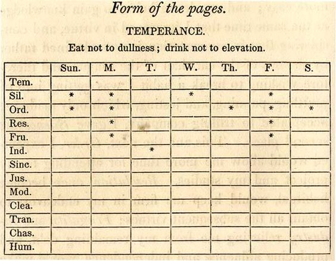

# Benjamin Franklin's Perfection Plan
This android app provides a tool to successfully follow Benjamin Franklin's plan for attaining moral perfection.

 

# Idea
At the age of 21, Benjamin Franklin decided to achieve moral perfection. He decided that 13 virtues were either necessary or desirable, arranged them so that the first acquired could help in assimilating the second, and so on:
1. Temperance
2. Silence
3. Order
4. Resolution
5. Frugality
6. Industry
7. Sincerity
8. Justice
9. Moderation
10. Cleanliness
11. Tranquility
12. Chastity
13. Humility

Franklin allotted himself one week to acquire each new virtue. And in order to see his progress, he made a record book and gave himself a black mark each time he failed to exhibit a virtue on which he was working. This app is served as a record book for your  marks.



# The app functionality
- Allows user to make and delete marks;
- Allows user to track data of previous weeks;
- Allows user to select virtue of the week;
- Saves marks and virtues of the week in a local database;
- Notifies user to make marks daily;
- Allows user to choose a time for notifications or turn them off.

# Developed by
- Tanya Iuferova - tanya.yu.95@gmail.com
- Vladimir Kazarin

# License
```
Copyright 2017 Tatiana Iuferova

Licensed under the Apache License, Version 2.0 (the "License");
you may not use this file except in compliance with the License.
You may obtain a copy of the License at

    http://www.apache.org/licenses/LICENSE-2.0

Unless required by applicable law or agreed to in writing, software
distributed under the License is distributed on an "AS IS" BASIS,
WITHOUT WARRANTIES OR CONDITIONS OF ANY KIND, either express or implied.
See the License for the specific language governing permissions and
limitations under the License.
```